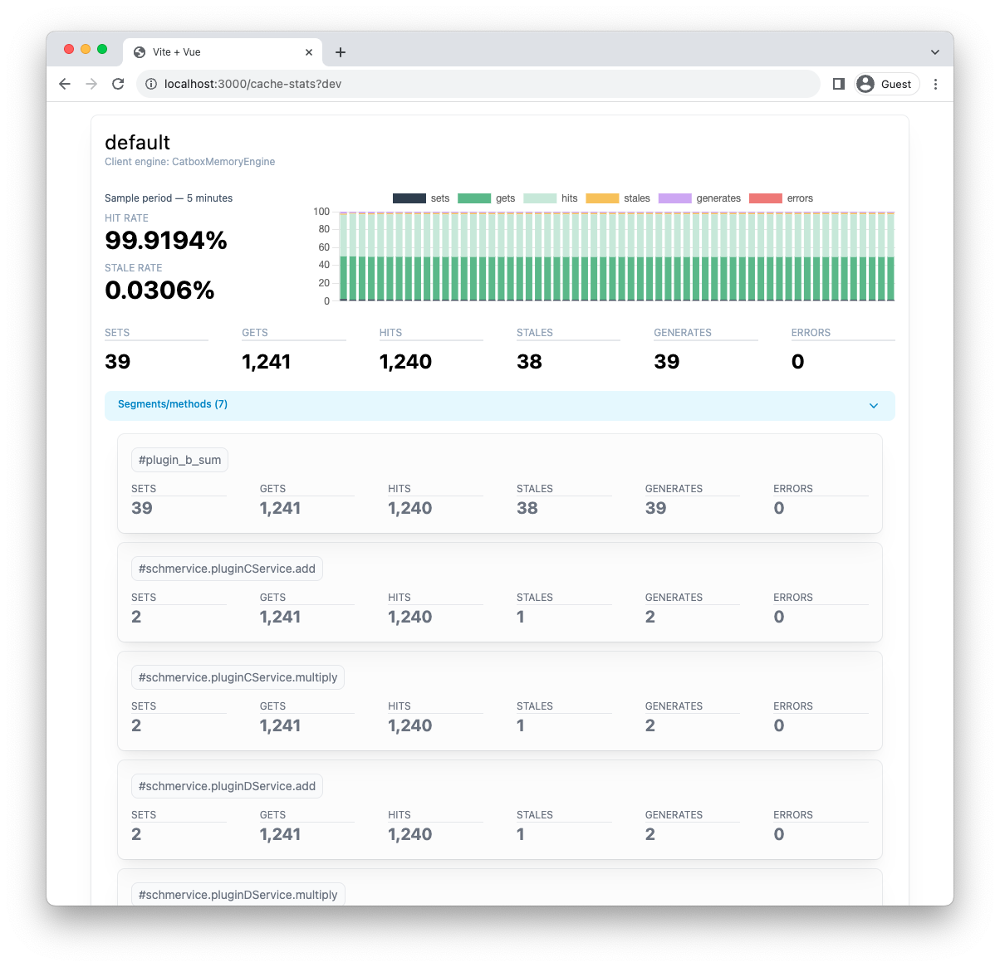

# @jameswragg/hapi-cache-stats

Cache insights for Hapi servers

## Installation

```bash
npm i @jameswragg/hapi-cache-stats
```

```javascript
const Hapi = require('@hapi/hapi');
const HapiCacheStats = require('@jameswragg/hapi-cache-stats');

(async () => {
  const server = Hapi.server({ port: 3000 });

  await server.register({
    plugin: HapiCacheStats,
    options: {
      // options here
    }
  });

  // app code here - using Catbox caches

  await server.start();

  console.log(`Start adding at ${server.info.uri}`);
})();
```

Then visit `http://localhost:3000/cache-stats` for live, real-time stats on all registered cache policies & method stats.

Main policy stats view


Seeing what methods use the cache policy & their individual stats


## Plugin options

* `base` - route to mount the UI on, default: `'/cache-stats'`
* `snapshot` - object with the following settings regarding snapshots:
  * `interval` - every X seconds, default: `5`
  * `retention`: how many snapshots to retain, default: `60`
* `socketIo` - socket.io [server options](https://socket.io/docs/v4/server-options/), default: `{ cors: { origin: '*' } }`


## Development

To contribute to the project:
1. Clone the repo
2. `npm install`
3. `npm run dev` - will file up an example server with policies, caches and a Vite server to host the frontend

Then append `?dev` to the url e.g. `http://localhost:3000/cache-stats?dev`. This will load the Vue front-end via the Vite  server instead of built assets, supporting HMR on change etc.
