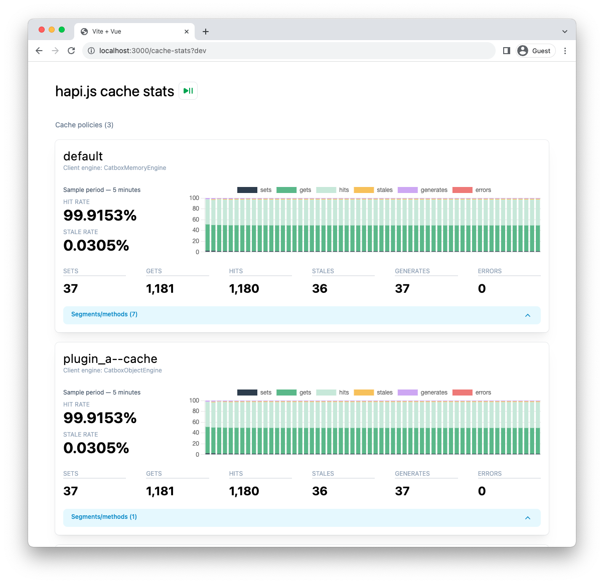

# @jameswragg/hapi-cache-stats

Cache insights for Hapi servers

## Installation

```bash
npm i @jameswragg/hapi-cache-stats
```

```javascript
const Hapi = require('@hapi/hapi');
const HapiCacheStats = require('@jameswragg/hapi-cache-stats')(async () => {
  const server = Hapi.server({ port: 3000 });

  await server.register(HapiCacheStats);

  // app code here - using Catbox caches

  await server.start();

  console.log(`Start adding at ${server.info.uri}`);
})();
```

Then visit `http://localhost:3000/cache-stats` for live, real-time stats on all registered cache policies & method stats.



